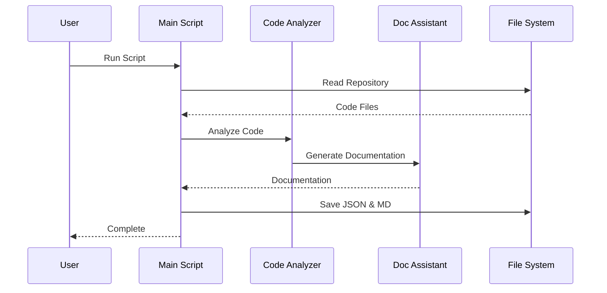

# AutogenRepoDocumentationGenerator

This project analyzes code repositories and generates comprehensive documentation using AI-powered agents. It automatically analyzes your codebase and generates detailed documentation including purpose, functionalities, architecture, notable features, libraries used, and usage examples. It utilizes OpenAI's language models via the AutoGen framework.

## Project Structure
```
autogen-repo-documentation-generator/
├── src/                                  # Source code
│     └── code_documentation_generator.py  # Main script for documentation generation
├── tests/                                # Test files and test repositories
├── docs/                                 # Documentation
│     └── CONTRIBUTING.md                 # Contribution guidelines
├── logs/                                 # Log files
│     └── debug.log                       # Application logs
├── reports/                              # Generated documentation output
│     ├── output.json                     # Latest JSON documentation
│     └── output.md                       # Latest Markdown documentation
├── config.yaml                           # Configuration file
├── .env                                  # Environment variables (not in git)
├── example_.env                          # Example environment file
├── requirements.txt                      # Python dependencies
├── LICENSE                               # MIT License
└── README.md                             # This file
```

## Flow Diagram

```mermaid
flowchart TD
    A[Repository Input] --> B[Code Analysis]
    B --> C{File Type}
    C -->|Python| D[Python Analysis]
    C -->|JavaScript| E[JavaScript Analysis]
    C -->|Other| F[Generic Analysis]
    D --> G[AI Processing]
    E --> G
    F --> G
    G --> H[Generate Documentation]
    H --> I[JSON Output]
    H --> J[Markdown Output]
    
    subgraph AI Agents
    K[Code Analyzer] --> L[Documentation Assistant]
    end
    
    G --> AI Agents
    AI Agents --> H
```

## Component Interaction



## Quick Start

1. Clone the repository:
```bash
git clone https://github.com/yourusername/autogen-repo-documentation-generator.git
cd autogen-repo-documentation-generator
```

2. Install dependencies:
```bash
pip install -r requirements.txt
```

3. Set up environment variables:
```bash
cp example_.env .env
# Edit .env with your OpenAI API key
```

4. Configure settings in `config.yaml`:
```yaml
# OpenAI settings
temperature: 0.2
seed: 42

# Rate limiting
max_api_calls_per_minute: 60

# Repository settings
repo_path: "tests"  # Path to the repository to analyze
```

5. Run the documentation generator:
```bash
python src/code_documentation_generator.py
```

6. Find the generated documentation in the `reports` directory:
- `reports/output.json` - Documentation in JSON format
- `reports/output.md` - Documentation in Markdown format

## Configuration

The `config.yaml` file contains several settings you can adjust:

- `temperature`: Controls the creativity of the AI responses (0.0-1.0)
- `seed`: Random seed for reproducible results
- `max_api_calls_per_minute`: Rate limiting for API calls
- `repo_path`: Path to the repository you want to analyze (relative to project root)

## Environment Variables

Create a `.env` file with the following variables:
```
MODEL_NAME=gpt-4
OPEN_AI_API_KEY=sk-your-api-key-here
OPENAI_API_BASE=https://api.openai.com/v1
```

## Output

The documentation generator produces two types of output in the `reports` directory:

1. JSON Output (`output.json`):
   - Structured data about your repository
   - Easy to parse and integrate with other tools
   - Contains all analyzed information

2. Markdown Output (`output.md`):
   - Human-readable documentation
   - Well-formatted and organized
   - Perfect for GitHub wikis or documentation sites

## Contributing

Please read [CONTRIBUTING.md](docs/CONTRIBUTING.md) for details on our code of conduct and the process for submitting pull requests.

## License

This project is licensed under the MIT License - see the [LICENSE](LICENSE) file for details.
